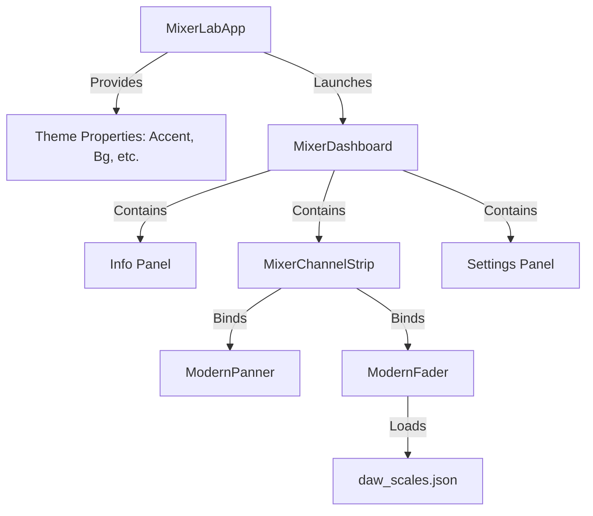

# Mixer Lab: Modern DAW Channel Strip

Mixer Lab is a premium, high-fidelity DAW (Digital Audio Workstation) channel strip prototype built with Python and Kivy. It features a fully responsive design, multi-DAW scaling, dynamic dark mode themes, and a real-time tri-color audio level meter.

---

## 📂 Project Structure

- **`main.py`**: The core application logic. Manages window settings, dynamic themes, math for dB interpolation, touch interactions, and the audio meter animation loop.
- **`mixerlab.kv`**: The Kivy layout definition stylesheet. Declares UI positioning, canvas drawing instructions (vectors, arcs, gradients), and reactive bindings.
- **`daw_scales.json`**: An external configuration file containing fader tick coordinate mappings for different DAWs (e.g. Logic Pro X).

---

## 📐 Architecture & Key Features



### 1. Dynamic Theming System
The app implements a reactive theme architecture. Four Dark Mode themes are defined with 2–3 colors (Accent, Secondary/Muted, Background, Widget Background).
- **Neon Ocean**: Cyber cyan with purple secondary.
- **Cyberpunk 2077**: Neon magenta with electric orange.
- **Forest Emerald**: Mint green with gold accents.
- **Obsidian Slate**: Crisp studio off-white on deep charcoal.

**How it works**: Color variables are registered as Kivy `ListProperty` bindings on the `App` class. All canvas instructions and label colors in `mixerlab.kv` reference `app.accent_color` or `app.widget_bg_color`. Changing the theme updates these variables, triggering a full GPU repaint instantly.

---

### 🎛️ Component Design

#### A. ModernPanner
- **Visuals**: A circular dial open at the bottom. It features a muted background arc and a colored active arc showing current panning.
- **Math & Layout**: To bypass standard Kivy coordinate wrapping boundaries, the arc is drawn statically from $0^\circ$ to $270^\circ$ inside a canvas matrix instruction and rotated $135^\circ$ using a `Rotate` instruction to point the gap downwards.
- **Text Formatting**: 
  - `C` at absolute center ($0.0$).
  - `L` and `R` at absolute outer boundaries ($-1.0$ and $+1.0$).
  - Numerical raw values (from `1` to `99`) in-between without redundant letters.

#### B. ModernFader (dB-Scale & Level Meter)
The fader combines a logarithmic scale, an open U-bracket cap, and an embedded signal level meter.

##### 1. Non-linear dB Scale Interpolation
Real fader slots utilize non-linear scaling (giving higher visual resolution near $0.0\text{ dB}$). We interpolate physical coordinates ($y$-coordinates from $0.0$ to $1.0$) into human-readable decibel values ($+6.0\text{ dB}$ down to $-\infty$) dynamically based on JSON specifications:
$$\text{Output dB} = \text{db}_2 + \frac{\text{pos} - p_2}{p_1 - p_2} \cdot (\text{db}_1 - \text{db}_2)$$
This segment-wise linear interpolation matches the exact layout of analog mixing consoles.

##### 2. Sideways U-Bracket Cap
The fader cap is rendered as a clean sideways `U` bracket (`[`), open to the right. The reactive dB value label (`db_text`) sits directly inside the opening, aligned on the cap's center $y$-coordinate.

##### 3. Real-Time Audio Level Meter
The fader contains an integrated LED level meter positioned directly behind the scale ticks.
- **Envelope Follower**: A fast-attack, slow-decay (release) filter simulates natural physical level dynamics:
  $$\text{Level}_t = \begin{cases} 
  \text{Level}_{t-1} + (\text{Target} - \text{Level}_{t-1}) \cdot 0.75 & \text{if Target} > \text{Level}_{t-1} \text{ (Attack)} \\
  \max(-96.0, \text{Level}_{t-1} - 1.8) & \text{otherwise (Release)}
  \end{cases}$$
- **Gain Attenuation**: The signal is driven by an animated track loop and attenuated by the fader's physical position. Pulling the fader to $-\infty$ silences the meter, while pushing it to $+6.0\text{ dB}$ drives it into the upper meter segments.
- **Theme-Aligned Meter Colors**: Instead of using fixed green/yellow/red across all themes, the meter colors dynamically adapt to the selected color palette:
  - **Neon Ocean**: Cyan $\rightarrow$ Indigo $\rightarrow$ Purple
  - **Cyberpunk**: Magenta $\rightarrow$ Red-Orange $\rightarrow$ Yellow
  - **Forest Emerald**: Forest Green $\rightarrow$ Mint Green $\rightarrow$ Gold
  - **Obsidian**: Dark Gray $\rightarrow$ Medium Gray $\rightarrow$ Off-White


---

## 🎚️ Interactive Controls

| Interaction | Gesture | Action |
| :--- | :--- | :--- |
| **Panner Control** | Vertical Drag | Changes panning position from L to R. |
| **Panner Reset** | Double Tap | Snaps panning back to **C** (Center). |
| **Fader Control** | Vertical Drag | Adjusts fader level. Grabbing tracks relatively to prevent values jumping. |
| **Fader Reset** | Double Tap | Snaps fader back to **$0.0\text{ dB}$** (nominal unity gain). |
| **Channel M / S / R / SEL** | Press | Toggles channel state (Active blue/highlight). |
| **Theme / DAW Swap** | Press | Swaps theme or DAW scaling instantly. |

---

## ⚙️ Configuration Schema (`daw_scales.json`)

You can define custom scales by modifying `daw_scales.json`.
```json
{
  "LogicPro": [
    {"pos": 1.00, "width": 30, "label": "6"},
    {"pos": 0.74, "width": 50, "label": "0"},
    {"pos": 0.00, "width": 30, "label": "00"}
  ]
}
```
- `pos`: Relative position on the track (from `0.00` at the bottom to `1.00` at the top).
- `width`: Length of the tick mark line in pixels.
- `label`: Decibel label. `0` marks the unity line (above is positive, below is negative). `00` denotes $-\infty$.

---

## 🚀 How to Run

1. Install requirements (requires `kivy`):
   ```bash
   pip install kivy
   ```
2. Start the application:
   ```bash
   python main.py
   ```
