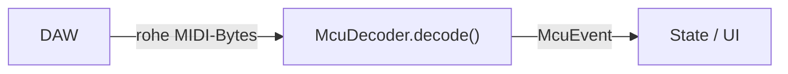

# MCU-Decoder & Events

Die **Protokollschicht** übersetzt zwischen rohen MIDI-Bytes und der restlichen
App. Eingehende Richtung (DAW → App) macht der `McuDecoder`: Er wandelt rohe
Nachrichten in **semantische Events** um, mit denen State und UI später arbeiten
– ganz ohne sich um Bytes zu kümmern.

- **Quelltext:** [`src/touchcontrol/mcu/events.py`](../src/touchcontrol/mcu/events.py),
  [`src/touchcontrol/mcu/decoder.py`](../src/touchcontrol/mcu/decoder.py)
- **Tests:** [`tests/test_decoder.py`](../tests/test_decoder.py)

---

## 1. Warum Events statt roher Bytes?

Ein **Event** ist ein kleines, unveränderliches Datenobjekt, das die *Bedeutung*
einer Nachricht ausdrückt – losgelöst von den Bytes:

```
[0xE0, 0x6C, 0x5E]   →   FaderEvent(channel=0, position=0.737…)
```

Der Rest der App (State, UI) muss dann nie wieder wissen, dass ein Fader als
Pitch-Bend ankommt. Das hält die Schichten sauber getrennt und macht alles gut
testbar.

### Aufbau



---

## 2. Die Events

Alle Events erben von `McuEvent` und sind `frozen` (**unveränderlich**): einmal
erzeugt, ändern sie sich nicht mehr. Das macht den Datenfluss vorhersehbar.

| Event | Felder | Bedeutung |
|---|---|---|
| `McuEvent` | – | gemeinsame Basis (nur Typ, keine Daten) |
| `FaderEvent` | `channel: int`, `position: float` | Faderbewegung von der DAW (Kanal 0–7, Position 0.0–1.0) |

> Weitere Event-Typen (Mute/Solo/Select-LEDs, Meter, V-Pot/Pan, LCD-Kanalnamen)
> kommen **schrittweise** dazu, sobald der Decoder sie unterstützt.

---

## 3. Der Decoder

### `McuDecoder.decode(message) -> McuEvent | None`

- Bekommt eine rohe MIDI-Nachricht (Liste von Byte-Werten).
- Erkennt den Typ am **Statusbyte** (oberes Nibble) und der Länge.
- Gibt das passende Event zurück – oder **`None`**, wenn die Nachricht zu keinem
  bekannten Typ gehört (z. B. ein Verbindungs-Ping der DAW). Unbekanntes ist
  **kein Fehler**, sondern wird bewusst ignoriert.

Aktuell erkannt: **Fader** (Pitch-Bend, oberes Nibble `0xE0`, genau 3 Bytes) →
`FaderEvent` über die reine Funktion `pitch_bend_to_fader`.

### `McuDecoder.decode_many(messages) -> list[McuEvent]`

- Dekodiert mehrere Nachrichten und lässt unbekannte (`None`) weg.
- Gedacht für den Alltag: `decoder.decode_many(backend.poll())`.

Der Decoder ist **reine Logik** – kein MIDI-I/O, keine UI – und damit
vollständig mit pytest prüfbar.

---

## 4. Die Tests

| Test | prüft |
|---|---|
| `test_decode_fader_liefert_faderevent` | Pitch-Bend → `FaderEvent` mit richtigem Kanal/Position |
| `test_decode_unbekannt_liefert_none` | unbekannter Nachrichtentyp → `None` |
| `test_decode_leere_nachricht_liefert_none` | leere Nachricht → `None` |
| `test_decode_pitchbend_falsche_laenge_liefert_none` | Pitch-Bend mit falscher Länge → `None` |
| `test_faderevent_ist_unveraenderlich` | `FaderEvent` ist `frozen` (nicht änderbar) |
| `test_decode_many_filtert_unbekannte` | `decode_many` lässt `None`-Ergebnisse weg |

### Ausführen

```bash
.venv/bin/python -m pytest tests/test_decoder.py
```
